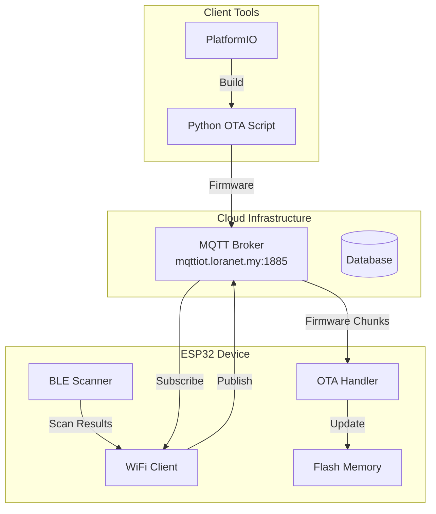
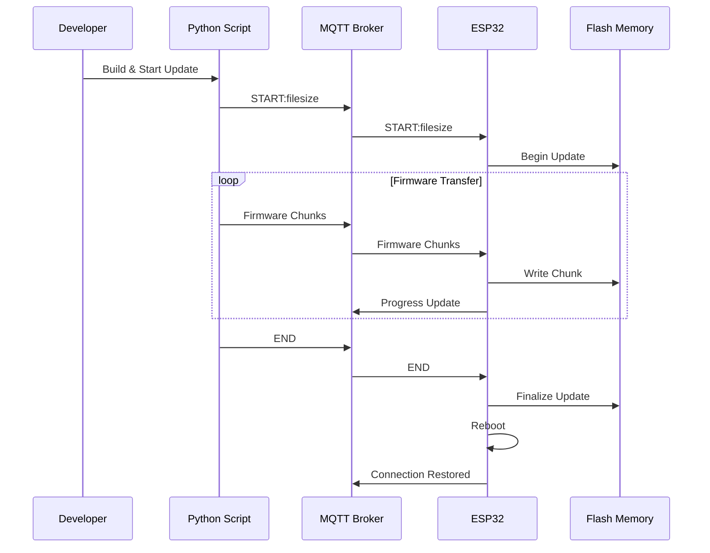
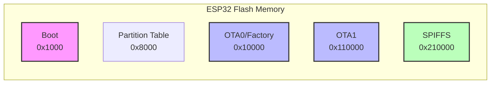
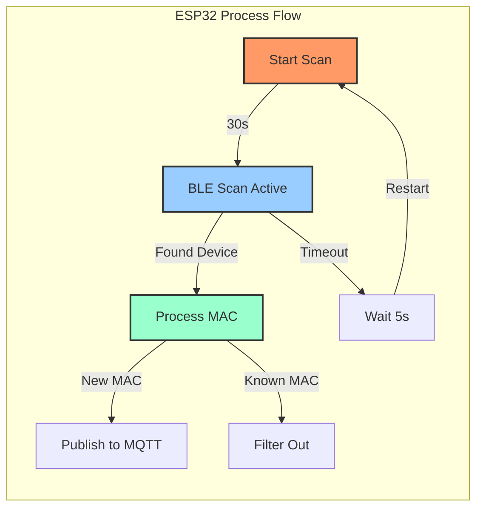
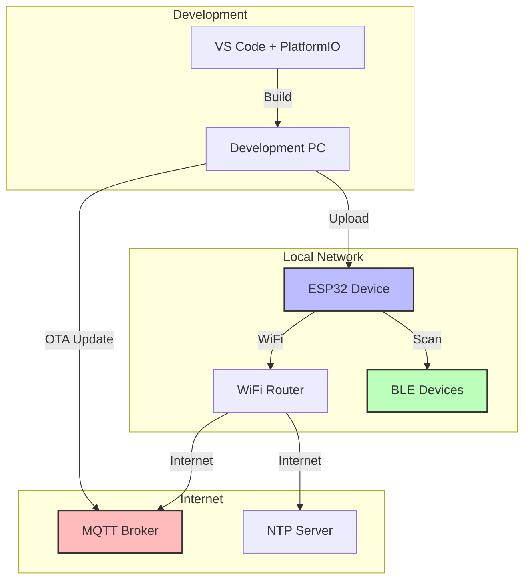
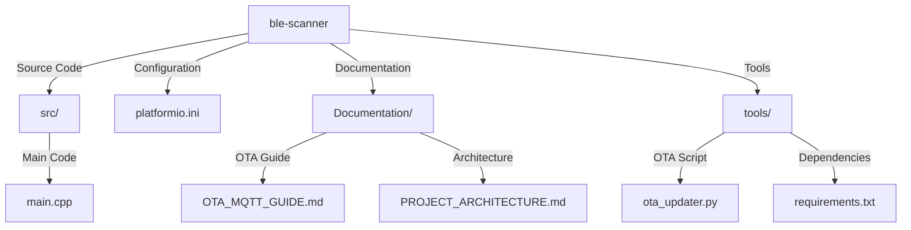

# BLE Scanner Project Architecture and Diagrams

## System Architecture

## OTA Update Sequence

## Memory Partition Layout

## BLE Scanning Process

## Network Architecture

## Project Directory Structure

